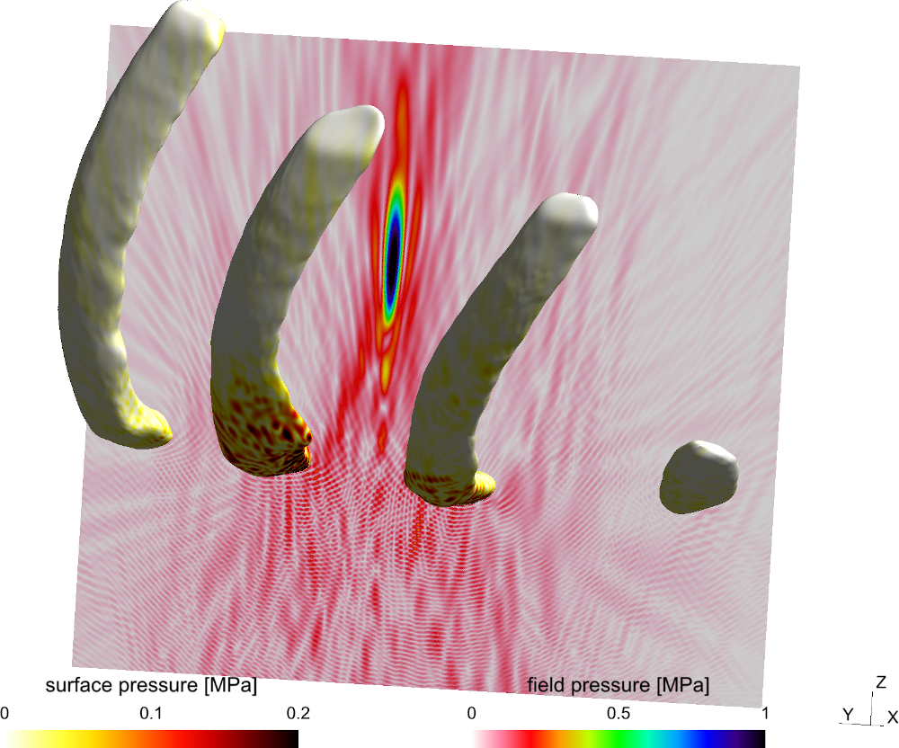
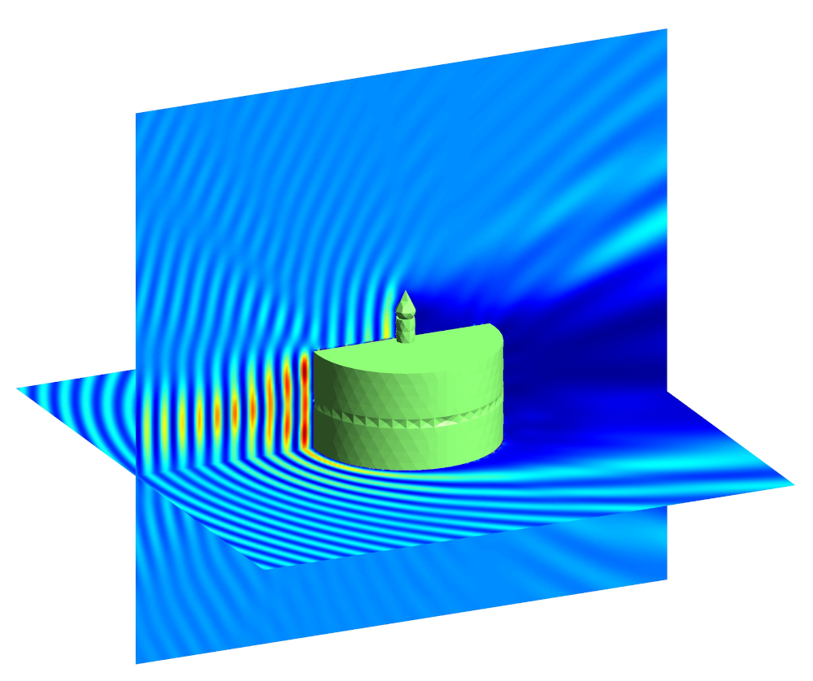

Bempp is an open-source computational boundary element platform to solve electrostatic, acoustic and electromagnetic problems. Features include:

+ Easy-to-use Python interface.
+ Support for triangular surface meshes.
+ Import and export in a number of formats, including Gmsh and VTK.
+ Easy formulation of acoustic and electromagnetic transmission problems.
+ CPU and GPU parallelisation.
+ A comprehensive operator algebra that makes it easy to formulate complex product operator formulations such as operator preconditioning.
+ Coupled FEM/BEM computations via interfaces to [FEniCS](https://fenicsproject.org).

### Latest version: {{site.bemppversion}}
#### ([View Changelog](changelog.md))
[Installation instructions](installation.md){: .colorlink}
[Start using Bempp](documentation/get_started.md){: .colorlink}
[View Source on GitHub](https://github.com/bempp/bempp-cl){: .colorlink}

## Bempp-cl
Bempp-cl is a complete rewrite of the Bempp library that uses [PyOpenCL](https://documen.tician.de/pyopencl/) for just-in-time compilation of computational kernels.
This new version is largely feature complete, however the legacy version ([Bempp 3.3.4](bempp334/)) has the following additional features:

+ Built-in fast hierarchical matrix compression techniques

Documentation for Bempp 3.3.4 is available [here](bempp334).

## Example applications
### High-intensity focused ultrasound
{: .image-right }
High-intensity focused ultrasound (HIFU) is a medical procedure that uses high-amplitude ultrasound waves to heat a small region of tissue, for example a cancerous tumour.

Before carrying out the procedure, it is important to simulate the process ensure that the surrounding tissue will not be subject to too much heat.
Bempp can be used to simulate HIFU using its acoustics functionality, including OSRC preconditioning for high-frequency problems.

More information about this application can be found in [van 't Wout _et al_ (2015)](publications.md#vantWout2015) and [Betcke _et al_ (2017)](publications.md#Betcke2017).

### Maxwell wave scattering
{: .image-right }
An important application of Bempp, and an area of much recent development, is the modelling of the scattering of electromagnetic waves.

For this type of problem, there are three well-known formulations available: the electric field (EFIE), magnetic field (MFIE) and combined field (CFIE) integral equations.
However, in order to ensure that solutions can be obtained in a reasonable amount of time, the function spaces used in the discretisation must be chosen carefully.

More information about this application can be found in [Scroggs _et al_ (2017)](publications.md#Scroggs2017) and in its example scripts.

## Development
Bempp is developed at [University College London](http://www.ucl.ac.uk) and [the University of Cambridge](https://www.cam.ac.uk/).
The [current development team](team.md) includes [Timo Betcke](https://timobetcke.me) and [Matthew Scroggs](http://www.mscroggs.co.uk).
Past contributors to the library include [Simon Arridge](http://cmic.cs.ucl.ac.uk/staff/simon_arridge/), [Elwin Van 't Wout](http://www.ing.uc.cl/cuerpo-docente/van-t-wout/),
and Wojciech Śmigaj.
You can find more information about the development team [here](team.md).

Bempp is supported by [EPSRC](http://www.epsrc.ac.uk/) Grants EP/I030042/1 and EP/K03829X/1.
We would like to thank
the [ExaFMM team](https://github.com/exafmm/exafmm-t) for their help integrating their library into Bempp and
the [HyENA team](http://portal.tugraz.at/portal/page/portal/Files/i2610/files/Forschung/Software/HyENA/html/index.html) at Graz University of Technology who provided definitions
of the core integration rules to the project.

Past versions of Bempp were aided by from the [Dune Project](https://www.dune-project.org/)
and the [UCL Research Software Development Team](http://www.ucl.ac.uk/research-it-services/about/research-software-development).

## Licensing
Bempp is covered by an MIT licence. The full licence can be read [here](https://github.com/bempp/bempp-cl/blob/main/LICENSE.md).
